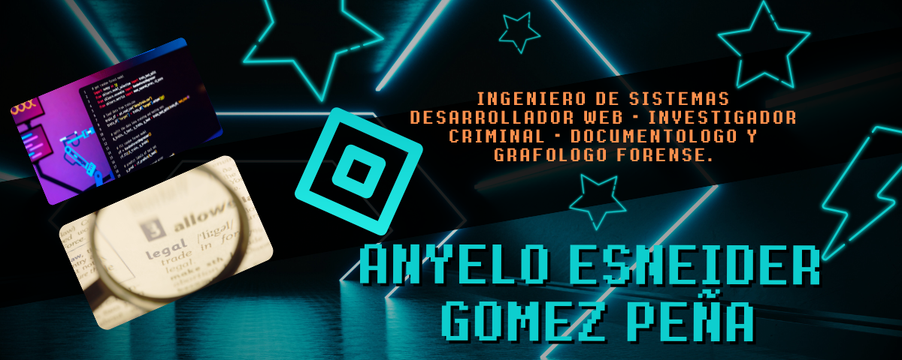
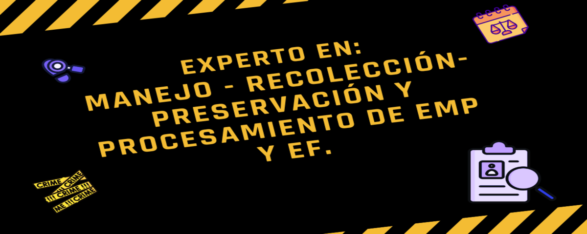

 # Bienvenid@ al Github de aegpgrafologo. 

_Amplia experiencia profesional en Investigación Criminal, manejo, recolección, preservación y procesamiento de Elementos Materiales Probatorios._

# Habilidades Técnicas - Desarollo de Software

>Conocimientos en las normas técnicas NTC-ISO/IEC 17020 y NTC-ISO/IEC 17025.
# Estadisticas

